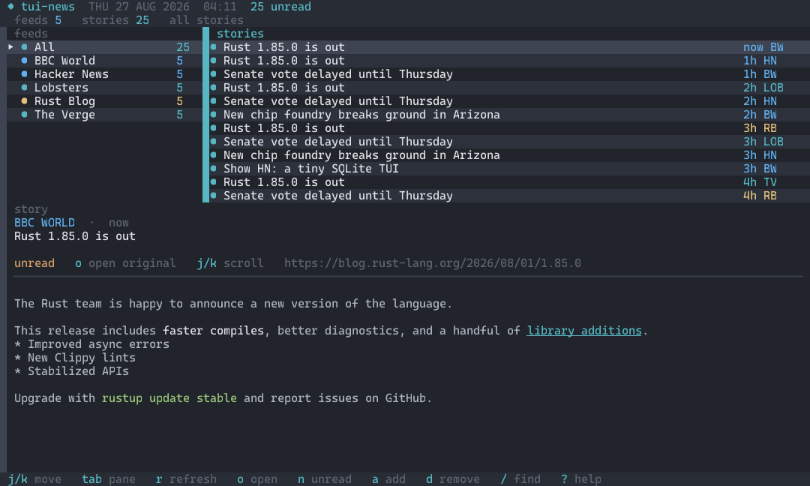
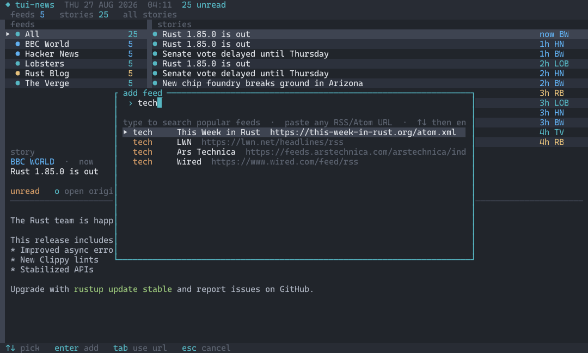
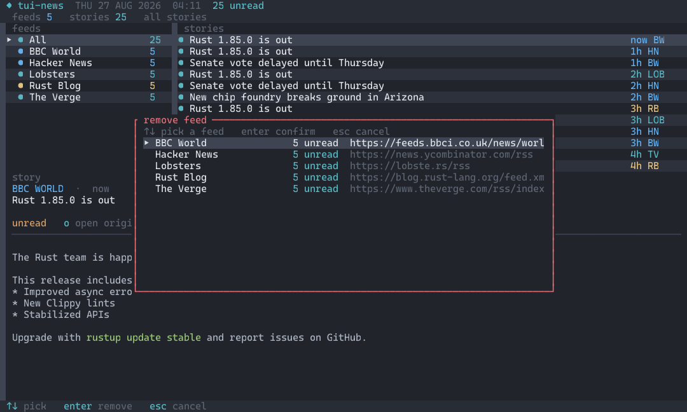
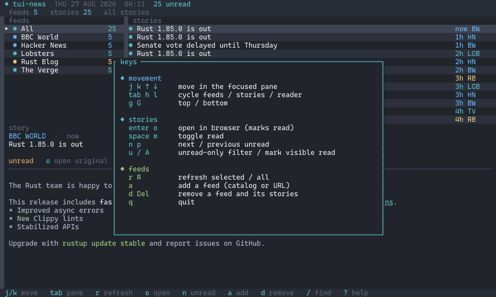

# tui-news

A keyboard-first RSS/Atom news reader for the terminal.

Three panes — feeds, stories, reader — with vim keys, unread tracking, and a local SQLite store. First launch seeds public feeds so there is something to read immediately.

[](https://github.com/DFanso/tui-news/actions/workflows/ci.yml)
[](https://github.com/DFanso/tui-news/releases)



## Install

### Prebuilt binaries

Download the latest build from [Releases](https://github.com/DFanso/tui-news/releases):

| Platform | Asset |
| --- | --- |
| Windows x64 | `tui-news-windows-x86_64.exe` |
| Linux x64 | `tui-news-linux-x86_64` |
| macOS Apple Silicon | `tui-news-macos-aarch64` |
| macOS Intel | `tui-news-macos-x86_64` |

On Unix:

```bash
chmod +x tui-news-linux-x86_64
./tui-news-linux-x86_64
```

On Windows, run `tui-news-windows-x86_64.exe`.

### From source

Needs Rust 1.85+ and a C compiler (bundled SQLite).

```bash
cargo install --git https://github.com/DFanso/tui-news
```

Or from a clone:

```bash
cargo install --path .
cargo run --release
```

## Usage

```bash
tui-news
tui-news --db ./mine.db
```

On first run the app creates a database and subscribes to Hacker News, BBC World, the Rust blog, Lobsters, and The Verge, then fetches them in the background.

Data lives in the platform user-data directory:

| OS | Path |
| --- | --- |
| Windows | `%APPDATA%\tui-news\tui-news.db` |
| macOS | `~/Library/Application Support/tui-news/tui-news.db` |
| Linux | `~/.local/share/tui-news/tui-news.db` |

## Add feeds

Press `a` to subscribe. Type to search a built-in catalog (NPR, Guardian, Ars Technica, NASA, …) or paste any RSS/Atom/JSON Feed URL.



`↑`/`↓` then `enter` adds the highlighted catalog feed. A pasted URL is added as-is. Already-subscribed feeds are hidden.

## Remove feeds

Press `d` (or `Delete`) to unsubscribe. Pick a feed, press `enter`, then `y` to confirm. Stories from that feed are deleted from the local database.



## Keys



| Key | Action |
| --- | --- |
| `j` `k` / arrows | Move in the focused pane |
| `tab` `h` `l` | Cycle feeds → stories → reader |
| `enter` / `o` | Open the story in a browser (marks read) |
| `space` / `m` | Toggle read |
| `n` / `p` | Next / previous unread |
| `r` / `R` | Refresh selected feed / all feeds |
| `a` | Add a feed (catalog or URL) |
| `d` / `Delete` | Remove a feed (pick, then confirm with `y`) |
| `/` | Search titles |
| `u` | Unread-only filter |
| `A` | Mark visible stories read |
| `?` | Key reference |
| `q` | Quit |

## Reading

The story pane uses the full width. HTML in the feed is rendered as terminal text: **bold**, *italic*, [links](), and `code`.

Some feeds (Hacker News, Lobsters) only send a **headline and link**. That is a publisher choice. Press `o` to open those in a browser. Feeds that include `<description>` or `<content:encoded>` show the body in the pane.

### Sinhala and other Indic text

The reader keeps Sinhala conjuncts (virama + ZWJ + consonant) in one terminal cell so Windows Terminal can shape them. Reinstall from git after this change:

```bash
cargo install --git https://github.com/DFanso/tui-news --force
```

If letters still look like boxes, the **font** has no Sinhala glyphs. In Windows Terminal: *Settings → Defaults → Appearance → Font face*, add a fallback such as **Iskoola Pota** or **Noto Sans Sinhala** (Cascadia Mono does not cover Sinhala).

## Theme

One Dark: slate background, cyan accent, blue feeds, orange tags, green when caught up, yellow while fetching, red on errors.

## Development

```bash
cargo test
cargo run
cargo run --example screenshots   # rewrite docs/screenshots/*.png
```

Release builds are produced on version tags (`v0.1.0`, …) by [`.github/workflows/release.yml`](.github/workflows/release.yml).

## License

MIT
